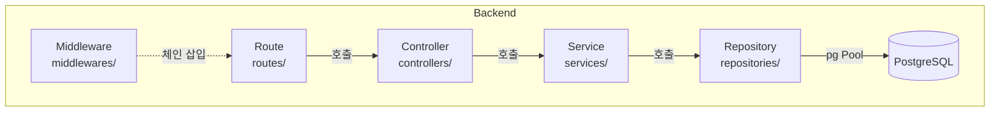
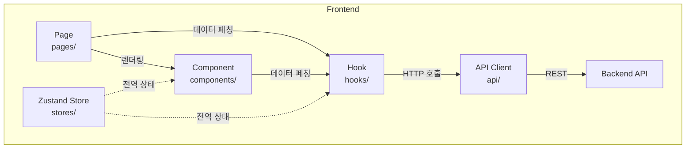

# TodoListApp 프로젝트 구조 설계 원칙

- 버전: 1.0.0
- 작성일: 2026-05-13
- 참조 문서:
  - `1-domain-definition.md` — 도메인 모델 및 비즈니스 규칙
  - `2-prd.md` — 기능/비기능 요구사항 및 API 목록
  - `3-user-scenario.md` — 주요 유스케이스 시나리오

---

## 변경 이력

| 버전  | 변경일     | 변경 내용 | 변경자   |
|-------|------------|-----------|----------|
| 1.0.0 | 2026-05-13 | 최초 작성 | aliceKim |
| 1.0.1 | 2026-05-13 | 백엔드 레이어에 Express·PostgreSQL 17 버전 명시, JWT 만료 정책·비밀번호 8자 검증 추가, 인증 전략 패턴 섹션 추가 | aliceKim |
| 1.0.2 | 2026-05-13 | JWT 저장 방식을 Zustand 메모리 저장으로 변경, storage.ts 제거, 토큰 저장 방식 섹션 추가 | aliceKim |

---

## 1. 공통 최상위 원칙

1. **관심사 분리 (Separation of Concerns)**: 라우팅·비즈니스 로직·데이터 접근·UI 렌더링은 각자의 레이어에서만 책임지며, 레이어 간 직접 참조를 허용하지 않는다.

2. **단일 책임 (Single Responsibility)**: 하나의 파일·모듈·함수는 하나의 역할만 수행한다. 한 함수가 200줄을 초과하면 분리를 검토한다.

3. **도메인 중심 구성 (Domain-First Organization)**: 파일을 기술 계층이 아닌 도메인(auth, users, todos, categories)을 기준으로 1차 분류한 뒤, 레이어로 2차 분류한다.

4. **환경 변수 기반 설정 (Externalized Configuration)**: 모든 환경 의존 값(DB 접속 정보, JWT 시크릿, 포트)은 코드에 하드코딩하지 않고 `.env` 파일과 환경 변수로 관리한다.

5. **명시적 에러 처리 (Explicit Error Handling)**: 모든 비동기 작업은 try/catch 또는 Promise 에러 핸들러로 감싸고, 에러는 반드시 중앙 에러 미들웨어까지 전파한다.

6. **불변 인터페이스 (Stable Interfaces)**: 레이어 간 데이터 교환은 TypeScript 타입/인터페이스로 명시적으로 정의하며, `any` 타입 사용을 금지한다.

7. **ORM 금지, Raw SQL 직접 사용**: DB 접근은 `pg` 라이브러리로만 수행하며, 모든 SQL은 파라미터화된 쿼리(`$1, $2, ...`)를 사용하여 SQL Injection을 방지한다.

---

## 2. 의존성 / 레이어 원칙

### 백엔드 레이어 구조

각 레이어는 바로 아래 레이어에만 의존한다. 상위 레이어가 하위 레이어를 직접 건너뛰는 것을 금지한다.

**Node.js + Express 기반 5단 레이어:**
```
Route → Controller → Service → Repository → DB (PostgreSQL 17)
```

| 레이어 | 역할 | 허용 의존 방향 |
|---|---|---|
| Route | Express Router — URL 매핑, 미들웨어 체인 연결, 요청 라우팅 | Controller만 호출 |
| Controller | 요청/응답 처리, 입력값 유효성 검사, HTTP 상태코드 결정 | Service만 호출 |
| Service | 비즈니스 로직, 트랜잭션 조율, 도메인 규칙 적용 | Repository만 호출 |
| Repository | SQL 쿼리 실행, DB 결과 매핑, pg (node-postgres) Pool 관리 | db 모듈(pg Pool)만 접근 |
| DB | PostgreSQL 17 연결 풀, 마이그레이션, 시드 데이터 | 외부 없음 |



**금지 규칙**:
- Controller가 Repository를 직접 호출하는 것을 금지한다.
- Service가 `req`, `res` 객체를 인자로 받는 것을 금지한다.
- Repository가 비즈니스 로직을 포함하는 것을 금지한다.

---

### 프론트엔드 레이어 구조

```
Page → Component → Hook (TanStack Query) → API Client → Backend REST API
```

| 레이어 | 역할 | 허용 의존 방향 |
|---|---|---|
| Page | 라우트 단위 화면, 레이아웃 조합, 전역 상태 구독 | Component, Hook 호출 |
| Component | UI 렌더링, 이벤트 처리, 표현 로직만 포함 | Hook 호출 가능, API Client 직접 호출 금지 |
| Hook | 서버 상태 관리(TanStack Query), 클라이언트 상태(Zustand) 접근 | API Client만 호출 |
| API Client | HTTP 요청 함수 집합, 요청/응답 직렬화, 인증 헤더 삽입 | 외부 REST API만 호출 |



**금지 규칙**:
- Component 내부에서 `fetch`나 `axios`를 직접 호출하는 것을 금지한다.
- Page가 API Client를 직접 import하는 것을 금지한다.
- Hook이 JSX를 반환하는 것을 금지한다(Custom Hook은 데이터/함수만 반환).

---

## 3. 코드 / 네이밍 원칙

### 파일명

| 구분 | 규칙 | 예시 |
|---|---|---|
| 백엔드 소스 파일 | `camelCase` | `todoService.ts`, `authController.ts` |
| 프론트엔드 컴포넌트 | `PascalCase` | `TodoCard.tsx`, `CategoryFilter.tsx` |
| 프론트엔드 Hook | `camelCase`, `use` 접두사 | `useTodos.ts`, `useAuth.ts` |
| 프론트엔드 API 모듈 | `camelCase`, `Api` 접미사 | `todoApi.ts`, `authApi.ts` |
| 타입 정의 파일 | `camelCase`, `.types.ts` 접미사 | `todo.types.ts`, `auth.types.ts` |
| 테스트 파일 | 대상 파일명 + `.test.ts(x)` | `todoService.test.ts` |

### 변수명 / 함수명

- 변수와 함수는 `camelCase`를 사용한다.
- 불리언 변수는 `is`, `has`, `can` 접두사를 붙인다 (예: `isCompleted`, `hasError`).
- 상수는 `UPPER_SNAKE_CASE`를 사용한다 (예: `JWT_EXPIRES_IN`).
- 배열 변수는 복수형 명사를 사용한다 (예: `todos`, `categories`).
- 비동기 함수는 동사로 시작한다 (예: `getTodoById`, `createTodo`, `deleteCategory`).

### 컴포넌트명

- React 컴포넌트는 반드시 `PascalCase`를 사용한다.
- 페이지 컴포넌트는 `Page` 접미사를 붙인다 (예: `TodoListPage`, `LoginPage`).
- 공통 UI 컴포넌트는 `common/` 디렉토리에 위치시킨다 (예: `Button`, `Input`, `Modal`).

### API 경로 네이밍

- 경로는 소문자 복수 명사를 사용한다 (예: `/api/todos`, `/api/categories`).
- 리소스 식별자는 `:id`를 사용한다 (예: `/api/todos/:id`).
- 동작(action)은 하위 경로로 표현한다 (예: `/api/todos/:id/complete`).
- 쿼리 파라미터는 `camelCase`를 사용한다 (예: `?categoryId=&isCompleted=`).

---

## 4. 테스트 / 품질 원칙

### 테스트 전략

| 테스트 유형 | 대상 | 도구 |
|---|---|---|
| 단위 테스트 | Service 레이어 비즈니스 로직, 유틸 함수 | Jest (백엔드), Vitest (프론트엔드) |
| 통합 테스트 | API 엔드포인트 (Controller + Service + Repository) | Supertest + Jest |
| 컴포넌트 테스트 | React 컴포넌트 렌더링 및 이벤트 | React Testing Library |

### 커버리지 목표

- 전체 코드 커버리지 80% 이상을 유지한다.
- Service 레이어는 90% 이상의 커버리지를 목표로 한다.
- 인증·권한 관련 로직(auth, JWT 미들웨어)은 100% 커버리지를 필수로 한다.

### 품질 게이트

- PR 병합 전 모든 테스트가 통과해야 한다.
- TypeScript 컴파일 에러가 없어야 한다 (`tsc --noEmit` 통과).
- ESLint 경고 0건을 유지한다.
- 테스트 커버리지가 80% 미만이면 병합을 차단한다.

---

## 5. 설정 / 보안 / 운영 원칙

### 환경 변수 관리

- 모든 환경 변수는 `.env` 파일에 정의하고, `.env.example`에 키 목록과 설명을 반드시 함께 관리한다.
- `.env` 파일은 `.gitignore`에 추가하여 절대 버전 관리하지 않는다.
- 서버 시작 시 필수 환경 변수 존재 여부를 검증하고, 누락 시 즉시 프로세스를 종료한다.

### 시크릿 처리

- JWT 시크릿은 최소 32자 이상의 랜덤 문자열을 사용하고 환경 변수로 주입한다.
- JWT Access Token 만료 시간은 `1h`로 설정하며, Refresh Token은 1차에서 미사용 (2차에서 도입 검토).
- 비밀번호는 최소 8자 이상 규칙을 Controller 레이어에서 검증한 후 `bcrypt` (saltRounds: 12)로 해시하여 저장하며, 평문 비밀번호를 로그에 출력하지 않는다.
- 데이터베이스 접속 정보는 코드에 직접 작성하지 않는다.

### 로깅

- 모든 HTTP 요청/응답은 구조화된 JSON 형식으로 기록한다 (요청 메서드, 경로, 상태코드, 소요 시간).
- 에러 로그에는 스택 트레이스를 포함하되, 응답 본문에는 노출하지 않는다.
- 운영 환경에서는 `info` 레벨 이상, 개발 환경에서는 `debug` 레벨 이상을 출력한다.

### 에러 처리

- 백엔드는 모든 에러를 중앙 에러 미들웨어(`errorHandler`)에서 일관된 JSON 형식으로 응답한다.
  ```json
  { "status": 400, "message": "제목은 필수입니다." }
  ```
- 프론트엔드는 TanStack Query의 `onError` 콜백과 전역 에러 바운더리를 통해 에러 상태를 처리한다.
- 500 에러의 내부 구현 상세 정보(스택 트레이스, SQL 쿼리 등)를 클라이언트에 노출하지 않는다.

### JWT 토큰 저장 방식

- JWT Access Token은 **Zustand 메모리(authStore)**에만 저장한다. `localStorage`, `sessionStorage`, `HTTP Only Cookie` 사용을 금지한다.
- 메모리 저장 선택 이유: XSS 공격으로 인한 토큰 탈취 위험을 최소화한다. localStorage는 JS로 접근 가능하여 XSS에 취약하다.
- 트레이드오프: 페이지 새로고침 시 토큰이 소멸되므로 사용자는 재로그인이 필요하다. 이는 의도된 설계이다.
- Axios 인터셉터는 요청 시 `authStore`에서 토큰을 읽어 `Authorization: Bearer {token}` 헤더를 자동 삽입한다.

### 인증 전략 패턴 (확장 설계)

- 인증 레이어는 `AuthStrategy` 인터페이스를 기반으로 전략 패턴으로 설계한다.
- 1차: `JwtStrategy` — JWT Access Token 검증 구현
- 2차 확장: `OAuthStrategy` (Google, Facebook) — 동일 인터페이스로 교체 가능하게 구성
- `authenticate` 미들웨어는 전략 구현체에만 의존하며, 전략 교체 시 미들웨어 코드를 변경하지 않는다.

### 보안 체크리스트

- 모든 인증 필요 API는 JWT 검증 미들웨어(`authenticate`)를 반드시 통과한다.
- 타인 리소스 접근 시도는 403 Forbidden으로 응답하며, 리소스 존재 여부를 노출하지 않는다.
- HTTPS를 적용하고, CORS는 허용 오리진을 명시적으로 지정한다.
- 모든 SQL 쿼리는 파라미터화된 쿼리를 사용하여 SQL Injection을 방지한다.

---

## 6. 백엔드 디렉토리 구조

`server/` 디렉토리를 루트로 한다.

```
server/
├── src/
│   ├── routes/                   # Express 라우터 정의 (URL 매핑만 담당)
│   │   ├── index.ts              # 전체 라우터 집합 및 /api prefix 등록
│   │   ├── authRoutes.ts         # POST /api/auth/register, POST /api/auth/login
│   │   ├── userRoutes.ts         # GET/PATCH/DELETE /api/users/me
│   │   ├── todoRoutes.ts         # GET/POST/PATCH/DELETE /api/todos, PATCH /api/todos/:id/complete
│   │   └── categoryRoutes.ts     # GET/POST/DELETE /api/categories, DELETE /api/categories/:id
│   │
│   ├── controllers/              # 요청/응답 처리, 입력값 검증, HTTP 상태코드 결정
│   │   ├── authController.ts     # register, login 핸들러
│   │   ├── userController.ts     # getMe, updateMe, deleteMe 핸들러
│   │   ├── todoController.ts     # getTodos, createTodo, updateTodo, deleteTodo, completeTodo 핸들러
│   │   └── categoryController.ts # getCategories, createCategory, deleteCategory 핸들러
│   │
│   ├── services/                 # 비즈니스 로직, 도메인 규칙 적용, 트랜잭션 조율
│   │   ├── authService.ts        # 회원가입(비밀번호 해시), 로그인(bcrypt 검증), JWT 발급
│   │   ├── userService.ts        # 내 정보 조회/수정, 회원 탈퇴(CASCADE 처리)
│   │   ├── todoService.ts        # 할일 CRUD, 소유권 검사, 완료 여부 토글
│   │   └── categoryService.ts    # 카테고리 조회/추가/삭제, 기본 카테고리 보호 규칙
│   │
│   ├── repositories/             # SQL 쿼리 실행, pg Pool 사용, DB 결과 → 타입 매핑
│   │   ├── userRepository.ts     # users 테이블 CRUD 쿼리
│   │   ├── todoRepository.ts     # todos 테이블 CRUD + 필터 쿼리
│   │   └── categoryRepository.ts # categories 테이블 CRUD 쿼리
│   │
│   ├── middlewares/              # Express 미들웨어 (횡단 관심사)
│   │   ├── authenticate.ts       # JWT 검증, req.user 주입
│   │   ├── errorHandler.ts       # 중앙 에러 처리, 표준 JSON 에러 응답
│   │   └── requestLogger.ts      # HTTP 요청/응답 구조화 로깅
│   │
│   ├── db/                       # PostgreSQL 연결 풀 및 DB 초기화
│   │   ├── pool.ts               # pg.Pool 인스턴스 생성 및 export
│   │   ├── migrations/           # SQL 마이그레이션 파일 (순번 prefix)
│   │   │   ├── 001_create_users.sql
│   │   │   ├── 002_create_categories.sql
│   │   │   └── 003_create_todos.sql
│   │   └── seeds/                # 초기 데이터 (기본 카테고리 등)
│   │       └── defaultCategories.sql
│   │
│   ├── types/                    # TypeScript 타입/인터페이스 정의
│   │   ├── auth.types.ts         # RegisterInput, LoginInput, JwtPayload
│   │   ├── user.types.ts         # User, UpdateUserInput
│   │   ├── todo.types.ts         # Todo, CreateTodoInput, UpdateTodoInput, TodoFilter
│   │   ├── category.types.ts     # Category, CreateCategoryInput
│   │   └── express.d.ts          # req.user 타입 확장 선언
│   │
│   └── utils/                    # 재사용 가능한 순수 유틸 함수
│       ├── jwt.ts                # JWT 생성(sign) 및 검증(verify) 래퍼
│       ├── hash.ts               # bcrypt 해시 생성 및 비교 래퍼
│       └── validate.ts           # 공통 입력값 검증 헬퍼 함수
│
├── tests/                        # 테스트 파일 (src/ 구조와 동일하게 미러링)
│   ├── unit/
│   │   ├── authService.test.ts
│   │   ├── todoService.test.ts
│   │   └── categoryService.test.ts
│   └── integration/
│       ├── auth.test.ts          # POST /api/auth/* 통합 테스트
│       ├── todos.test.ts         # /api/todos/* 통합 테스트
│       └── categories.test.ts    # /api/categories/* 통합 테스트
│
├── .env                          # 환경 변수 (gitignore 대상)
├── .env.example                  # 환경 변수 키 목록 및 설명 (버전 관리 포함)
├── .gitignore
├── package.json
├── tsconfig.json
└── app.ts                        # Express 앱 생성, 미들웨어/라우터 등록, 서버 시작
```

### 주요 디렉토리 역할 요약

| 디렉토리 | 역할 |
|---|---|
| `routes/` | URL 경로와 컨트롤러 핸들러를 연결한다. 미들웨어 체인 순서도 여기서 정의한다. |
| `controllers/` | HTTP 요청을 파싱하고 서비스 결과를 HTTP 응답으로 변환한다. 비즈니스 로직을 포함하지 않는다. |
| `services/` | 도메인 비즈니스 규칙을 구현한다. 여러 Repository를 조합하여 트랜잭션을 조율할 수 있다. |
| `repositories/` | 파라미터화된 SQL을 실행하고, DB 결과 행(Row)을 TypeScript 타입으로 변환한다. |
| `middlewares/` | 인증, 로깅, 에러 처리 등 요청 처리 파이프라인의 횡단 관심사를 담당한다. |
| `db/` | pg Pool 인스턴스를 싱글톤으로 관리하고, 마이그레이션/시드 SQL 파일을 보관한다. |
| `types/` | 프로젝트 전체에서 공유하는 TypeScript 타입과 인터페이스를 정의한다. |
| `utils/` | 특정 레이어에 종속되지 않는 순수 함수(JWT, bcrypt, 검증 등)를 제공한다. |

---

## 7. 프론트엔드 디렉토리 구조

`client/` 디렉토리를 루트로 한다.

```
client/
├── src/
│   ├── pages/                    # 라우트 단위 화면 컴포넌트 (레이아웃 + 데이터 페칭 조율)
│   │   ├── auth/
│   │   │   ├── LoginPage.tsx     # SCR-02: 로그인 화면
│   │   │   └── RegisterPage.tsx  # SCR-01: 회원가입 화면
│   │   ├── todos/
│   │   │   └── TodoListPage.tsx  # SCR-03·04: 할일 목록 + 등록/수정 화면
│   │   ├── categories/
│   │   │   └── CategoryPage.tsx  # SCR-05: 카테고리 관리 화면
│   │   └── users/
│   │       └── ProfilePage.tsx   # SCR-06: 내 정보 수정 화면
│   │
│   ├── components/               # 재사용 가능한 UI 컴포넌트
│   │   ├── common/               # 도메인 비의존 공통 컴포넌트
│   │   │   ├── Button.tsx
│   │   │   ├── Input.tsx
│   │   │   ├── Modal.tsx
│   │   │   ├── Spinner.tsx
│   │   │   └── ErrorMessage.tsx
│   │   ├── todos/                # 할일 도메인 컴포넌트
│   │   │   ├── TodoCard.tsx      # 개별 할일 카드 (완료 토글 버튼 포함)
│   │   │   ├── TodoList.tsx      # 할일 목록 렌더링
│   │   │   ├── TodoForm.tsx      # 할일 등록/수정 폼 (모달 내부)
│   │   │   └── TodoFilter.tsx    # 카테고리·기간·완료 여부 필터 UI
│   │   ├── categories/           # 카테고리 도메인 컴포넌트
│   │   │   ├── CategoryList.tsx  # 카테고리 목록 표시
│   │   │   └── CategoryForm.tsx  # 카테고리 추가 폼
│   │   └── layout/               # 레이아웃 관련 컴포넌트
│   │       ├── Header.tsx
│   │       └── PrivateRoute.tsx  # 인증된 사용자만 접근 허용하는 라우트 가드
│   │
│   ├── hooks/                    # TanStack Query + Zustand 기반 커스텀 훅
│   │   ├── auth/
│   │   │   ├── useLogin.ts       # POST /api/auth/login 뮤테이션
│   │   │   └── useRegister.ts    # POST /api/auth/register 뮤테이션
│   │   ├── todos/
│   │   │   ├── useTodos.ts       # GET /api/todos 쿼리 (필터 파라미터 포함)
│   │   │   ├── useCreateTodo.ts  # POST /api/todos 뮤테이션
│   │   │   ├── useUpdateTodo.ts  # PATCH /api/todos/:id 뮤테이션
│   │   │   ├── useDeleteTodo.ts  # DELETE /api/todos/:id 뮤테이션
│   │   │   └── useCompleteTodo.ts# PATCH /api/todos/:id/complete 뮤테이션
│   │   ├── categories/
│   │   │   ├── useCategories.ts  # GET /api/categories 쿼리
│   │   │   ├── useCreateCategory.ts
│   │   │   └── useDeleteCategory.ts
│   │   └── users/
│   │       ├── useMe.ts          # GET /api/users/me 쿼리
│   │       ├── useUpdateMe.ts    # PATCH /api/users/me 뮤테이션
│   │       └── useDeleteMe.ts    # DELETE /api/users/me 뮤테이션
│   │
│   ├── stores/                   # Zustand 전역 클라이언트 상태 스토어
│   │   ├── authStore.ts          # 인증 상태 메모리 저장 (accessToken, 로그인 여부, 사용자 정보) — localStorage/Cookie 미사용
│   │   └── todoFilterStore.ts    # 할일 목록 필터 상태 (categoryId, 기간, isCompleted)
│   │
│   ├── api/                      # Axios 기반 HTTP 요청 함수 모음 (레이어 최하단)
│   │   ├── client.ts             # Axios 인스턴스 생성, 인증 헤더 인터셉터 설정
│   │   ├── authApi.ts            # register, login API 함수
│   │   ├── todoApi.ts            # getTodos, createTodo, updateTodo, deleteTodo, completeTodo
│   │   ├── categoryApi.ts        # getCategories, createCategory, deleteCategory
│   │   └── userApi.ts            # getMe, updateMe, deleteMe
│   │
│   ├── types/                    # 프론트엔드 TypeScript 타입/인터페이스
│   │   ├── auth.types.ts         # LoginInput, RegisterInput, AuthResponse
│   │   ├── todo.types.ts         # Todo, CreateTodoInput, UpdateTodoInput, TodoFilter
│   │   ├── category.types.ts     # Category, CreateCategoryInput
│   │   └── user.types.ts         # User, UpdateUserInput
│   │
│   └── utils/                    # 프론트엔드 공통 유틸 함수
│       ├── formatDate.ts         # 날짜 포맷 변환 (dueDate 표시 등)
│       └── errorMessage.ts       # API 에러 응답에서 사용자 메시지 추출
│
├── tests/                        # 프론트엔드 테스트 파일
│   ├── components/
│   │   ├── TodoCard.test.tsx
│   │   └── TodoForm.test.tsx
│   └── hooks/
│       └── useTodos.test.ts
│
├── public/
├── index.html
├── .env                          # 환경 변수 (VITE_API_BASE_URL 등, gitignore 대상)
├── .env.example                  # 환경 변수 키 목록 및 설명
├── .gitignore
├── package.json
├── tsconfig.json
└── vite.config.ts
```

### 주요 디렉토리 역할 요약

| 디렉토리 | 역할 |
|---|---|
| `pages/` | 라우트와 1:1로 매핑되는 화면 단위 컴포넌트. 데이터 페칭 훅을 호출하고 하위 컴포넌트를 조합한다. |
| `components/common/` | 도메인에 의존하지 않는 재사용 UI 요소(버튼, 인풋, 모달 등)를 제공한다. |
| `components/{domain}/` | 특정 도메인(todos, categories)의 표현 로직을 담은 컴포넌트. API 직접 호출 금지. |
| `hooks/` | TanStack Query의 `useQuery`/`useMutation`을 래핑하여 서버 상태를 관리한다. |
| `stores/` | Zustand로 클라이언트 전용 전역 상태(인증 토큰, 필터 값)를 관리한다. |
| `api/` | Axios 인스턴스와 도메인별 API 호출 함수를 제공한다. 인증 토큰 헤더 삽입은 인터셉터에서 처리한다. |
| `types/` | 백엔드 응답 구조와 동기화된 TypeScript 타입을 정의한다. `any` 사용을 금지한다. |
| `utils/` | 날짜 포맷, 로컬스토리지 접근, 에러 메시지 변환 등 순수 헬퍼 함수를 제공한다. |
