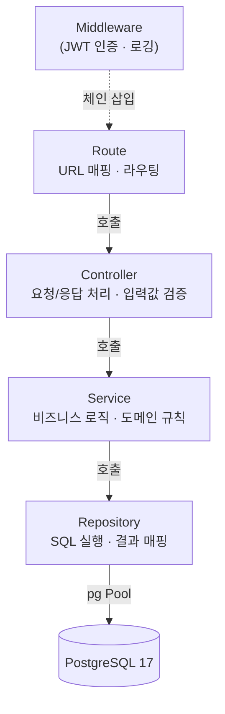
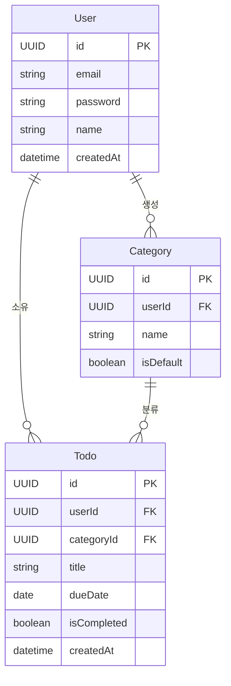
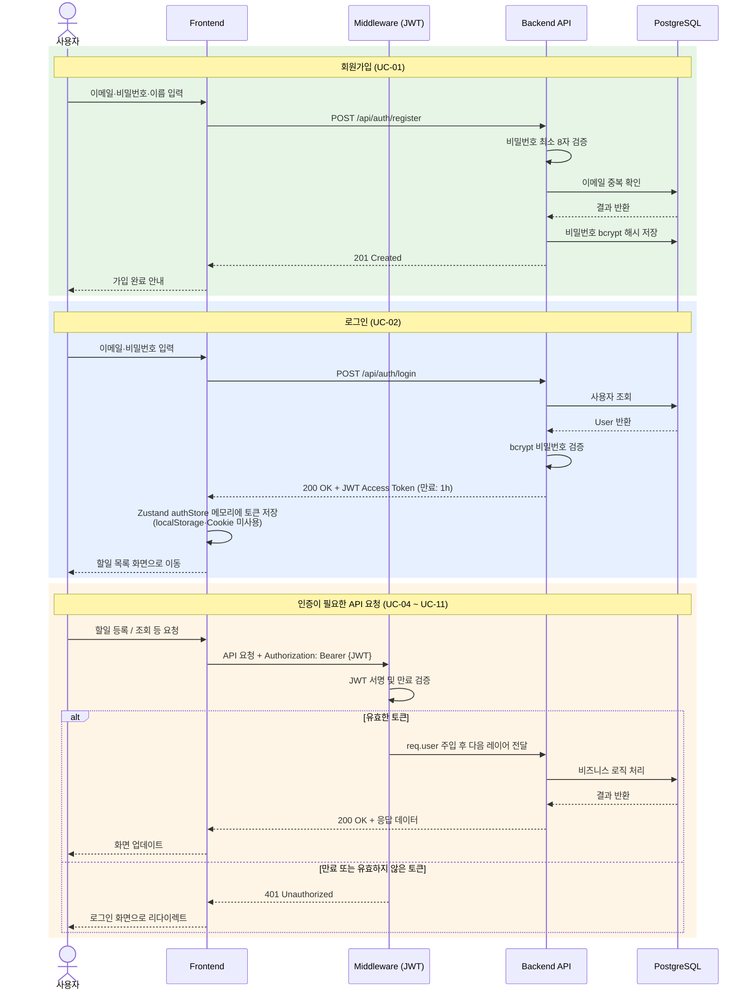

# TodoListApp 기술 아키텍처 다이어그램

- 버전: 1.0.0
- 작성일: 2026-05-13
- 참조 문서:
  - `1-domain-definition.md` — 도메인 모델 및 엔티티 관계
  - `2-prd.md` — 기능/비기능 요구사항 및 API 목록
  - `4-project-principles.md` — 레이어 구조 및 의존성 원칙

---

## 변경 이력

| 버전  | 변경일     | 변경 내용 | 변경자   |
|-------|------------|-----------|----------|
| 1.0.0 | 2026-05-13 | 최초 작성 | aliceKim |
| 1.0.1 | 2026-05-13 | 4. 인증 흐름 다이어그램 추가 | aliceKim |
| 1.0.2 | 2026-05-13 | 시스템 아키텍처에 HTTPS 명시, 인증 흐름에 비밀번호 8자 검증·JWT 만료 시간(1h) 추가 | aliceKim |
| 1.0.3 | 2026-05-13 | 인증 흐름에 Zustand 메모리 저장 명시 (localStorage·Cookie 미사용) | aliceKim |

---

## 1. 전체 시스템 아키텍처

```mermaid
graph LR
    Client["웹/모바일 브라우저<br/>(반응형)"]

    subgraph Frontend["Frontend (React 19 + TypeScript)"]
        Page["Page"]
        Component["Component"]
        Hook["Hook<br/>(TanStack Query)"]
        Store["Zustand Store"]
        APIClient["API Client<br/>(Axios)"]
    end

    subgraph Backend["Backend (Node.js + Express)"]
        Route["Route"]
        Controller["Controller"]
        Service["Service"]
        Repository["Repository"]
    end

    DB[("PostgreSQL 17")]

    Client -->|HTTP 요청| Page
    Page --> Component
    Page --> Hook
    Component --> Hook
    Hook --> APIClient
    Store -.->|전역 상태| Hook
    Store -.->|전역 상태| Component

    APIClient -->|REST API (HTTPS)<br/>JSON| Route
    APIClient -.->|JWT Access Token<br/>Authorization 헤더| Route

    Route --> Controller
    Controller --> Service
    Service --> Repository
    Repository -->|SQL (pg)| DB
```

---

## 2. 백엔드 레이어 구조



---

## 3. 데이터베이스 ERD



---

## 4. 인증 흐름


