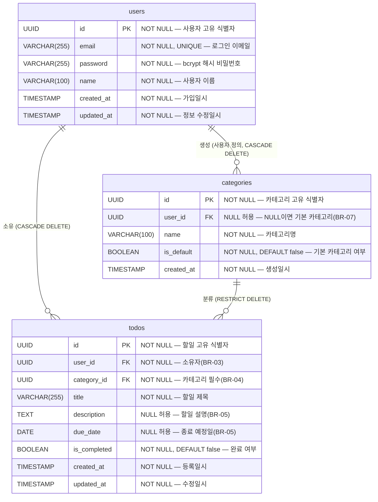

# TodoListApp ERD

- 버전: 1.0.0
- 작성일: 2026-05-13
- 참조 문서:
  - `1-domain-definition.md` — 도메인 모델 및 엔티티 관계
  - `2-prd.md` — 기능/비기능 요구사항 및 비즈니스 규칙
  - `5-arch-diagram.md` — 기술 아키텍처 다이어그램

---

## 변경 이력

| 버전  | 변경일     | 변경 내용 | 변경자   |
|-------|------------|-----------|----------|
| 1.0.0 | 2026-05-13 | 최초 작성 | aliceKim |

---

## 1. ERD 다이어그램 (Mermaid)

> **관계 카디널리티 읽는 법**
>
> - `||` : 정확히 1개 (필수)
> - `o{` : 0개 이상 (선택적 다수)
> - `users ||--o{ todos` : 사용자 1명은 할일 0개 이상을 소유한다.
> - `users ||--o{ categories` : 사용자 1명은 사용자 정의 카테고리 0개 이상을 생성한다.
> - `categories ||--o{ todos` : 카테고리 1개는 할일 0개 이상과 연결된다.

---

## 2. 테이블 정의

### 2.1 users

사용자 계정 정보를 저장하는 테이블. 이메일은 로그인 식별자로 변경 불가(BR-12).

#### 컬럼 정의

| 컬럼명       | 타입           | NULL 허용 | 기본값            | 설명                           |
|-------------|----------------|-----------|-------------------|-------------------------------|
| id          | UUID           | NOT NULL  | gen_random_uuid() | 사용자 고유 식별자 (PK)        |
| email       | VARCHAR(255)   | NOT NULL  | —                 | 로그인 이메일, 변경 불가(BR-12)|
| password    | VARCHAR(255)   | NOT NULL  | —                 | bcrypt 해시 비밀번호           |
| name        | VARCHAR(100)   | NOT NULL  | —                 | 사용자 이름                    |
| created_at  | TIMESTAMP      | NOT NULL  | NOW()             | 가입일시                       |
| updated_at  | TIMESTAMP      | NOT NULL  | NOW()             | 정보 수정일시                  |

#### 제약 조건

| 제약 유형  | 컬럼       | 내용                          |
|-----------|------------|-------------------------------|
| PRIMARY KEY | id       | 단일 기본키                   |
| UNIQUE    | email      | 이메일 중복 가입 방지          |
| NOT NULL  | email, password, name, created_at, updated_at | 필수값 보장 |

#### 인덱스

| 인덱스명               | 컬럼   | 유형   | 목적                      |
|-----------------------|--------|--------|---------------------------|
| users_pkey            | id     | PK     | 기본키 조회               |
| users_email_key       | email  | UNIQUE | 이메일 중복 확인 및 로그인 조회 |

---

### 2.2 categories

할일 분류 카테고리 테이블. 기본 카테고리(is_default=true)는 user_id가 NULL이며 모든 사용자가 공유한다(BR-07). 사용자 정의 카테고리(is_default=false)는 user_id가 해당 사용자 ID로 설정된다(BR-09).

#### 컬럼 정의

| 컬럼명      | 타입           | NULL 허용 | 기본값            | 설명                                         |
|------------|----------------|-----------|-------------------|--------------------------------------------|
| id         | UUID           | NOT NULL  | gen_random_uuid() | 카테고리 고유 식별자 (PK)                    |
| user_id    | UUID           | NULL 허용 | NULL              | 소유자 FK. NULL=기본 카테고리(BR-07)         |
| name       | VARCHAR(100)   | NOT NULL  | —                 | 카테고리명                                  |
| is_default | BOOLEAN        | NOT NULL  | false             | 기본 카테고리 여부. true이면 user_id는 NULL  |
| created_at | TIMESTAMP      | NOT NULL  | NOW()             | 생성일시                                    |

#### 제약 조건

| 제약 유형   | 컬럼                  | 내용                                               |
|------------|----------------------|----------------------------------------------------|
| PRIMARY KEY | id                  | 단일 기본키                                        |
| FOREIGN KEY | user_id → users.id  | ON DELETE CASCADE — 사용자 탈퇴 시 사용자 정의 카테고리 삭제 |
| UNIQUE      | (user_id, name)     | 동일 사용자 내 카테고리명 중복 방지(UC-09)          |
| CHECK       | is_default=true → user_id IS NULL | 기본 카테고리는 user_id가 반드시 NULL  |
| NOT NULL    | name, is_default, created_at | 필수값 보장                               |

> **참고**: UNIQUE(user_id, name) 제약에서 user_id가 NULL인 기본 카테고리는 PostgreSQL의 NULL 비교 특성상 중복 체크가 되지 않으므로, 기본 카테고리 이름 중복은 애플리케이션 레벨(seed 데이터 관리)로 제어한다.

#### 인덱스

| 인덱스명                       | 컬럼              | 유형    | 목적                              |
|-------------------------------|-------------------|---------|-----------------------------------|
| categories_pkey               | id                | PK      | 기본키 조회                       |
| categories_user_id_idx        | user_id           | B-Tree  | 사용자별 카테고리 목록 조회        |
| categories_user_id_name_key   | (user_id, name)   | UNIQUE  | 사용자 내 카테고리명 중복 방지     |

---

### 2.3 todos

할일 정보를 저장하는 테이블. category_id는 NOT NULL이므로 할일 등록 시 카테고리 선택이 필수이다(BR-04). 할일이 연결된 카테고리는 삭제 불가(BR-10, RESTRICT).

#### 컬럼 정의

| 컬럼명       | 타입           | NULL 허용 | 기본값            | 설명                               |
|-------------|----------------|-----------|-------------------|------------------------------------|
| id          | UUID           | NOT NULL  | gen_random_uuid() | 할일 고유 식별자 (PK)              |
| user_id     | UUID           | NOT NULL  | —                 | 소유자 FK → users.id               |
| category_id | UUID           | NOT NULL  | —                 | 카테고리 FK → categories.id        |
| title       | VARCHAR(255)   | NOT NULL  | —                 | 할일 제목                          |
| description | TEXT           | NULL 허용 | NULL              | 할일 설명 (선택, BR-05)            |
| due_date    | DATE           | NULL 허용 | NULL              | 종료 예정일 (선택, BR-05)          |
| is_completed | BOOLEAN       | NOT NULL  | false             | 완료 여부. 완료 후 취소 가능(BR-06)|
| created_at  | TIMESTAMP      | NOT NULL  | NOW()             | 등록일시                           |
| updated_at  | TIMESTAMP      | NOT NULL  | NOW()             | 수정일시                           |

#### 제약 조건

| 제약 유형   | 컬럼                        | 내용                                                 |
|------------|-----------------------------|------------------------------------------------------|
| PRIMARY KEY | id                         | 단일 기본키                                          |
| FOREIGN KEY | user_id → users.id         | ON DELETE CASCADE — 사용자 탈퇴 시 할일 전체 삭제    |
| FOREIGN KEY | category_id → categories.id | ON DELETE RESTRICT — 할일 연결된 카테고리 삭제 차단(BR-10) |
| NOT NULL    | user_id, category_id, title, is_completed, created_at, updated_at | 필수값 보장 |

#### 인덱스

| 인덱스명                    | 컬럼                      | 유형   | 목적                                   |
|----------------------------|---------------------------|--------|----------------------------------------|
| todos_pkey                 | id                        | PK     | 기본키 조회                            |
| todos_user_id_idx          | user_id                   | B-Tree | 사용자별 할일 목록 조회(UC-08)         |
| todos_category_id_idx      | category_id               | B-Tree | 카테고리별 필터링 조회(UC-08)          |
| todos_user_id_created_at_idx | (user_id, created_at DESC) | B-Tree | 사용자별 할일 등록일 내림차순 정렬(기본 정렬) |
| todos_user_id_due_date_idx | (user_id, due_date)       | B-Tree | 종료 기간 필터링 조회(UC-08)           |

---

## 3. 관계 정의

### 3.1 users — todos (1:N)

| 항목       | 내용                                                |
|-----------|-----------------------------------------------------|
| 관계 유형  | 1:N (사용자 1명 : 할일 N개)                         |
| 참조 컬럼  | todos.user_id → users.id                            |
| 삭제 정책  | CASCADE DELETE — 사용자 삭제 시 해당 사용자의 할일 전체 삭제 |
| 적용 규칙  | BR-03 (사용자는 자신의 할일만 접근), UC-11 (회원 탈퇴 시 데이터 즉시 삭제) |
| 비고       | todos.user_id는 NOT NULL — 할일은 반드시 소유자가 있어야 한다 |

### 3.2 users — categories (1:N, 사용자 정의 카테고리)

| 항목       | 내용                                                              |
|-----------|-------------------------------------------------------------------|
| 관계 유형  | 1:N (사용자 1명 : 사용자 정의 카테고리 N개)                       |
| 참조 컬럼  | categories.user_id → users.id                                     |
| 삭제 정책  | CASCADE DELETE — 사용자 삭제 시 해당 사용자의 사용자 정의 카테고리 삭제 |
| 적용 규칙  | BR-07 (기본 카테고리 user_id=NULL), BR-09 (사용자 정의 카테고리는 해당 사용자만 접근) |
| 비고       | categories.user_id는 NULL 허용 — NULL이면 시스템 기본 카테고리, NOT NULL이면 사용자 정의 카테고리 |

### 3.3 categories — todos (1:N)

| 항목       | 내용                                                              |
|-----------|-------------------------------------------------------------------|
| 관계 유형  | 1:N (카테고리 1개 : 할일 N개)                                     |
| 참조 컬럼  | todos.category_id → categories.id                                 |
| 삭제 정책  | RESTRICT — 할일이 연결된 카테고리는 삭제 불가(BR-10)              |
| 적용 규칙  | BR-04 (할일 등록 시 카테고리 필수, todos.category_id NOT NULL), BR-10 (할일 연결 카테고리 삭제 차단) |
| 비고       | 카테고리 삭제 전 연결된 할일이 없음을 애플리케이션 레벨에서 확인 후 409 Conflict 반환(UC-10) |

---

### 비즈니스 규칙 매핑 요약

| 비즈니스 규칙 | DB 설계 반영 내용                                                               |
|--------------|---------------------------------------------------------------------------------|
| BR-03        | todos.user_id NOT NULL FK → 소유자 필수, 서비스 레이어에서 JWT userId 비교 검증  |
| BR-04        | todos.category_id NOT NULL → 카테고리 없는 할일 등록 불가                        |
| BR-05        | todos.description, todos.due_date NULL 허용                                     |
| BR-06        | is_completed 토글 구조 — 완료 후 재수정 가능, DB 제약 없음(서비스 레이어 허용)  |
| BR-07        | categories.user_id NULL 허용, is_default=true이면 user_id=NULL로 공유 카테고리  |
| BR-09        | categories.user_id=요청자 ID로 저장, 조회 시 WHERE user_id=? OR is_default=true |
| BR-10        | categories → todos FK ON DELETE RESTRICT                                        |
| BR-12        | users.email UNIQUE, 서비스 레이어에서 이메일 수정 API 미제공                    |
| UC-11        | users 삭제 → todos CASCADE DELETE, 사용자 정의 categories CASCADE DELETE         |
