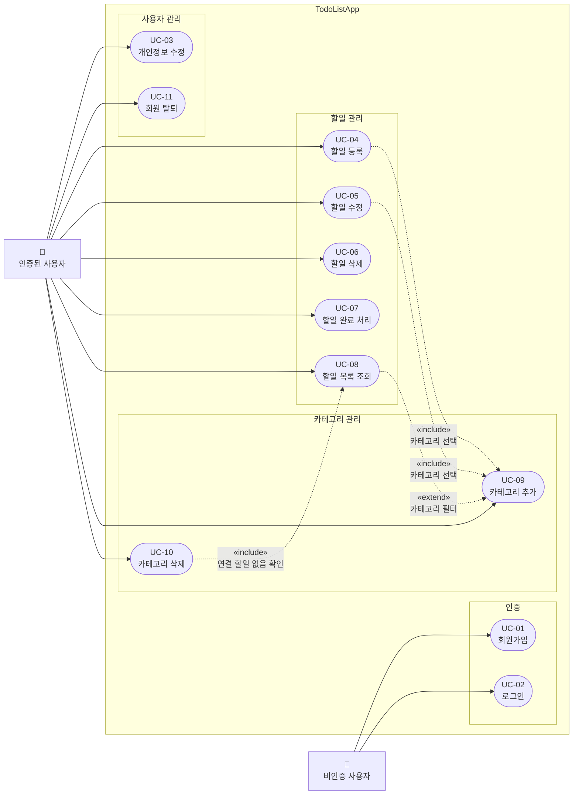

# TodoListApp Use Case Diagram

## 액터 정의

| 액터          | 설명                                  |
| ------------- | ------------------------------------- |
| 비인증 사용자 | 회원가입 또는 로그인 전 상태의 사용자 |
| 인증된 사용자 | 로그인하여 유효한 JWT를 보유한 사용자 |

## 관계 정의

| 관계        | 유스케이스           | 설명                                        |
| ----------- | -------------------- | ------------------------------------------- |
| `«include»` | UC-04, UC-05 → UC-09 | 할일 등록·수정 시 카테고리 선택 필수        |
| `«include»` | UC-10 → UC-08        | 카테고리 삭제 전 연결된 할일 존재 여부 확인 |
| `«extend»`  | UC-08 → UC-09        | 할일 목록 조회 시 카테고리 필터 선택적 적용 |
